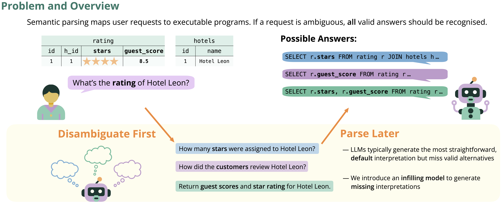
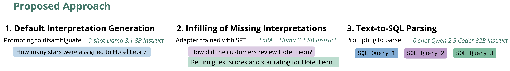

# Disambiguate First, Parse Later: Generating Interpretations for Ambiguity Resolution in Semantic Parsing




---
This repository contains a framework for handling ambiguous natural language questions in text-to-SQL tasks, supporting two main datasets: [Ambrosia](https://ambrosia-benchmark.github.io/) and [AmbiQT](https://github.com/testzer0/AmbiQT).

The main idea is to disambiguate the question into natural language interpretations first, then parse each interpretation into a SQL query:



I. Disambiguation:

   1. Generating initial set of interpretations (default or preferred interpretations)

   2. Infilling the set with missing interpretations

II. Text-to-SQL Parsing


---

We use a modular design to handle the different tasks:
- Generating initial set: Zero-shot prompting with text-based LLM (Llama 3.1 8B Instruct)
- Infilling the set: Finetuned adapter
- Text-to-SQL parsing: Zero-shot prompting with specialized code LLM (Qwen2.5-Coder 32B Instruct)

We also provide the code for annotating AmbiQT with synthetic gold interpretations that we used to finetune the infilling model.

## Changelog

### 24.07.25
- Added infilling model checkpoints from Hugging Face Hub
- Added generated default interpretations
- Updated docker images
- Added BibTeX citation

## Installation

For fast generation, we use [Text Generation Inference](https://github.com/huggingface/text-generation-inference.git) through the docker image: `docker.io/irisaparina/disambiguate-then-parse-tgi:latest` 

For finetuning, we use [Unsloth](https://github.com/unslothai/unsloth) through the docker image: `docker.io/irisaparina/disambiguate-then-parse-unsloth:latest`

Most of the scripts support both Unsloth and TGI through the `--backend` argument except for the finetuning script.


## Data
You can find AmbiQT in the `data/AmbiQT` folder. Unzip `db-content.zip` and create folders for fixed databases (with unique values):

```bash
cd data/AmbiQT
unzip db-content.zip
mkdir db-content/database_syn db-content/database_syn_eval 
```

You also need to download the `Ambrosia` dataset from the [official website](https://ambrosia-benchmark.github.io/) and put it in the `data/ambrosia` folder.

To resplit the Ambrosia dataset for training, you can use the `src/utils/resplit_ambrosia.py` script.

Gold interpretations for AmbiQT are stored in the `data/ambiqt_gold_interpretations` folder. To reproduce them, you can use the `src/annotate_ambiqt_with_gold_interpretations.py` script:

```bash
python src/annotate_ambiqt_with_gold_interpretations.py \
    --model_name meta-llama/Meta-Llama-3.1-8B-Instruct \
    --backend tgi \
    --tgi_url "http://0.0.0.0/v1" \
    --split SPLIT # train or test
```


## Configuration

The repository uses YAML configuration files in `src/configs/` to manage various settings:

- `dataset_configs.yaml`: Dataset loading parameters and filtering options
- `train.yaml`: Training hyperparameters and model settings

You can also override any config parameter via command line arguments when running the scripts.

## Inference
### Models

The system has three main components:
- Initial interpretation generation
- Infilling model
- Unambiguous text-to-SQL parser

In the paper, we used Llama 3.1 8B Instruct as a generator for initial interpretations and Qwen2.5 Coder 32B Instruct for text-to-SQL parsing. We trained a LoRA adapter for Llama 3.1 8B Instruct for the infilling model.

Below are the infilling models on Hugging Face:

| Model | Train Set |
|-----------------------------------------------|-----------------------------|
| [irisaparina/llama-3-8b-instruct-ambiqt-infilling-lora](https://huggingface.co/irisaparina/llama-3-8b-instruct-ambiqt-infilling-lora) | AMbiQT |
| [irisaparina/llama-3-8b-instruct-ambrosia-infilling-lora](https://huggingface.co/irisaparina/llama-3-8b-instruct-ambrosia-infilling-lora) | Ambrosia* |
| [irisaparina/llama-3-8b-instruct-infilling-lora](https://huggingface.co/irisaparina/llama-3-8b-instruct-infilling-lora) | AMbiQT + Ambrosia* |

*Ambrosia* is a re-split of the Ambrosia dataset for training.

### Running the System

Pre-generated interpretations from Llama 3.1 8B Instruct are in `outputs/initial_interpretaions_with_sql_filtered`.

To run inference with the infilling model:

```bash
# DATASET_TYPE: ambiqt or ambrosia
# PATH_TO_DATA: the path to the parent directory containing AmbiQT/ and ambrosia/
python src/finetuning.py \
    --hf_token HF_TOKEN \
    --model_name meta-llama/Meta-Llama-3.1-8B-Instruct \
    --model_sql_name Qwen/Qwen2.5-Coder-7B-Instruct \
    --interpretation_model_train llama-3.1-8b-instruct \
    --interpretation_model_test llama-3.1-8b-instruct \
    --dataset_type_test DATASET_TYPE \
    --data_dir PATH_TO_DATA \
    --learn_missing \
    --mode test \
    --test_checkpoint INFILLING_MODEL_NAME_OR_PATH
```

By default, this will use Qwen2.5 Coder 7B Instruct for SQL generation from the infilled interpretations. For improved results, you can use a larger code generation model, such as Qwen2.5 Coder 32B Instruct, in a separate step:

```bash
python src/generate_sql_from_final_interpretations.py \
    --hf_token HF_TOKEN \
    --model_name Qwen/Qwen2.5-Coder-32B-Instruct \
    --test_predictions FINETUNING_RESULTS_FILE \
    --backend tgi \
    --tgi_url "http://0.0.0.0/v1"
```


## Full Pipeline
### Generating initial interpretations

1. To generate the initial interpretations, use the `src/generate_initial_interpretations.py` script:

```bash
# DATASET_TYPE: ambiqt or ambrosia
# SPLIT: train or test or validation (for ambrosia only)
python src/generate_initial_interpretations.py \
    --model_name meta-llama/Meta-Llama-3.1-8B-Instruct \
    --dataset_type DATASET_TYPE \
    --split SPLIT \
    --backend tgi \
    --tgi_url "http://0.0.0.0/v1"
```

2. Then generate SQL queries for the initial interpretations using the `src/generate_sql_from_initial_interpretations.py` script:

```bash
python src/generate_sql_from_initial_interpretations.py \
    --model_name Qwen/Qwen2.5-Coder-32B-Instruct \
    --interpretation_file INTERPRETATION_FILE \
    --backend tgi \
    --tgi_url "http://0.0.0.0/v1"
```

`INTERPRETATION_FILE` is the file with the initial interpretations generated by the `src/generate_initial_interpretations.py` script, e.g. `outputs/initial_interpretations/initial_interpretations_meta-llama-3.1-8b-instruct_seed42_ambiqt_train_tgi.json`.

3. Finally, filter the initial interpretations using the `src/filter_initial_interpretations.py` script:

```bash
python src/filter_initial_interpretations.py \
    --input_file INTERPRETATION_WITH_SQL_FILE
```

### Infilling with missing interpretations

To infill the set of interpretations, train the adapter using the `src/finetuning.py` script:

```bash
# model_sql_name: model for SQL generation during validation
python src/finetuning.py \
    --hf_token HF_TOKEN \
    --model_name meta-llama/Meta-Llama-3.1-8B-Instruct \
    --model_sql_name Qwen/Qwen2.5-Coder-7B-Instruct \
    --interpretation_model_train llama-3.1-8b-instruct \
    --interpretation_model_test llama-3.1-8b-instruct \
    --dataset_type DATASET_TYPE \
    --learn_missing \
    --num_epoch 15 \
    --validation_checkpoints 5  # use 5 best checkpoints for validation
```

By default `src/finetuning.py`  does training, validation and runs inference but if you want to run inference only, you can use the `--mode test` argument:

```bash
python src/finetuning.py \
    --hf_token HF_TOKEN \
    --model_name meta-llama/Meta-Llama-3.1-8B-Instruct \
    --model_sql_name Qwen/Qwen2.5-Coder-7B-Instruct \
    --interpretation_model_train llama-3.1-8b-instruct \
    --interpretation_model_test llama-3.1-8b-instruct \
    --dataset_type_test DATASET_TYPE \
    --data_dir PATH_TO_DATA \
    --learn_missing \
    --mode test \
    --test_checkpoint CHECKPOINT_PATH
```

The script uses resplitted Ambrosia dataset by default. If you want to use the original Ambrosia dataset, use the `--ambrosia_file data/ambrosia/data/ambrosia.csv` argument.

## Text-to-SQL Parsing and Evaluation

Finally, generate SQL queries for the infilled interpretations using the `src/generate_sql_from_final_interpretations.py` script. It works on top of the predictions from the `src/finetuning.py` script.

```bash
python src/generate_sql_from_final_interpretations.py \
    --hf_token HF_TOKEN \
    --model_name Qwen/Qwen2.5-Coder-32B-Instruct \
    --test_predictions FINETUNING_RESULTS_FILE \
    --backend tgi \
    --tgi_url "http://0.0.0.0/v1"
```

The script has an option to recompute SQL queries for the initial interpretations or use the existing SQL queries (`--use_existing_sql_prediction`).

## Citation

```
@inproceedings{saparina2025disambiguate,
  title={Disambiguate First, Parse Later: Generating Interpretations for Ambiguity Resolution in Semantic Parsing},
  author={Saparina, Irina and Lapata, Mirella},
  booktitle={Findings of ACL},
  year={2025},
  url={https://aclanthology.org/2025.findings-acl.863/}
}
```